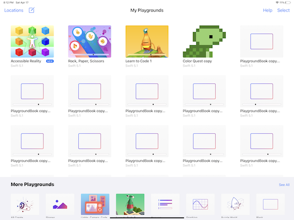
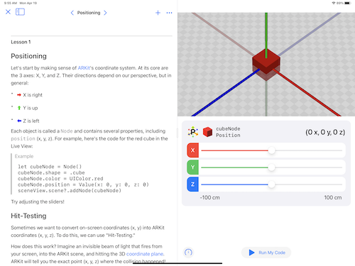
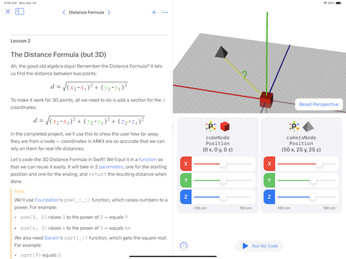
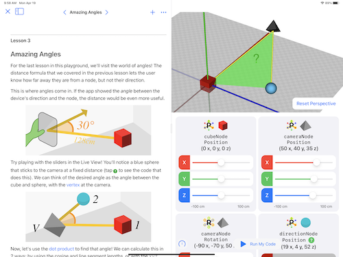
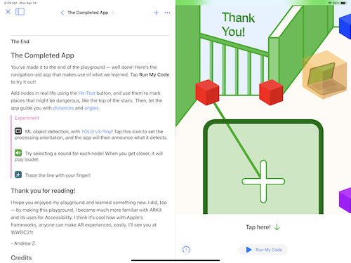
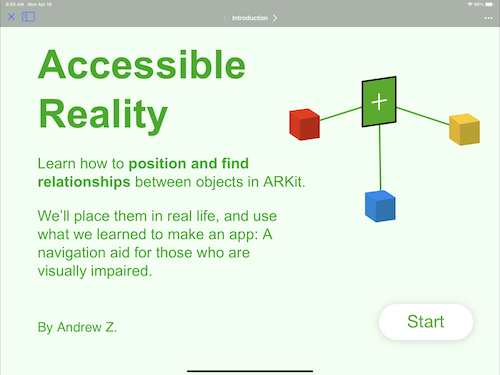
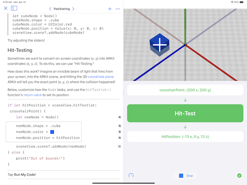
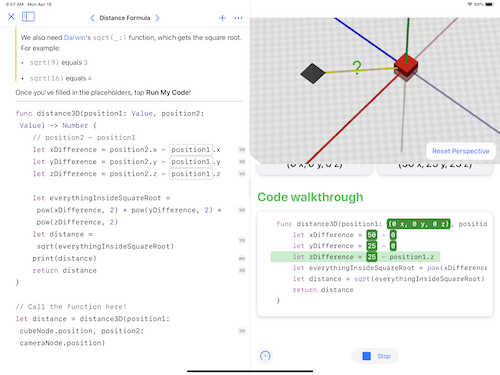
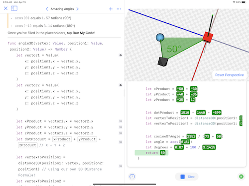
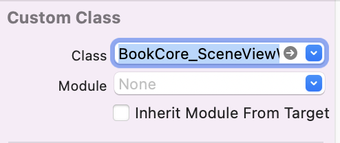

## My WWDC21 Swift Student Challenge submission
I made a playground book that teaches you the basics of ARKit through interactive lessons. It covers positioning, hit-testing, and how to calculate relationships between objects. In the end, it combines all these concepts into an app: A navigation aid for those who are visually impaired.

**Status:** Submitted

## Screenshots

Intro | Positioning | Distances | Angles | Completed App
--- | --- | --- | --- | ---
[](GitHub/Screenshots/Thumb-Gallery.PNG) | [](GitHub/Screenshots/Positioning.PNG) | [](GitHub/Screenshots/Distance.PNG) | [](GitHub/Screenshots/Angle.PNG) | [](GitHub/Screenshots/Completed.PNG)
[](GitHub/Screenshots/Intro.PNG) | [](GitHub/Screenshots/Positioning-run.PNG) | [](GitHub/Screenshots/Distance-run.PNG) | [](GitHub/Screenshots/Angle-run.PNG) | [](GitHub/Screenshots/Completed-run.PNG)

## Want to make your own playground book?
For me, making a playground book was much harder than a regular Xcode project. Here's some tips that I picked up along the way.

### Development
- Instead of dragging files into the project, create them locally (<kbd>Command</kbd> + <kbd>N</kbd>), then copy over the contents. Whenever I dragged in a file, I got a "There was a problem running this page" error.
- Use ARKit instead of RealityKit. The camera preview works, but I was never able to see my objects in the scene.
- Pre-compile ML models if possible. See [this article](https://heartbeat.fritz.ai/how-to-run-and-test-core-ml-models-in-swift-playgrounds-8e4b4f9cf676) for details.
- To change the name of the playground, edit the `BuildSettings.xcconfig` file
- You might need to add required capabilities for in the `Manifest.plist` file, for example `arkit`. [See here](https://developer.apple.com/documentation/bundleresources/information_property_list/uirequireddevicecapabilities) for the possible values.

<kbd></kbd>

### Storyboards
- Every time you make changes in the storyboard, clean the project (<kbd>Shift</kbd> + <kbd>Command</kbd> + <kbd>K</kbd>), otherwise your changes won't show
- The Assistant editor doesn't work, so you need to manually add a new editor using the  buttons
- For any views or view controllers that you put in the storyboard, make sure that the class has the `@objc(BookCore_YOURCLASSNAME)` tag. For example:
```swift
@objc(BookCore_SceneViewWrapper)
class SceneViewWrapper: UIView { }
```
Then, in the storyboard, make sure **Module** is set to `None` and **Inherit Module From Target** is unchecked. Your custom class should look like this: 

<kbd></kbd>


### Debugging
- To avoid the "There was a problem running this page" error, **turn on Authoring Debug Mode in the Settings app**. This gives you the full stack trace! If only I knew this earlier... I was commenting out lines of code until the error went away, AirDropping to my iPad every time. Go upvote [their answer on Stack Overflow](https://stackoverflow.com/a/67076862/14351818) *now*.
- You can get the playground page's current text, including the user-modified code, with `PlaygroundPage.current.text`. Put the below code in `viewDidLoad` to see what it is (for testing purposes).
```swift
DispatchQueue.main.asyncAfter(deadline: .now() + 1.0) {
    let text = PlaygroundPage.current.text
    let label = UILabel()
    self.view.addSubview(label)
    label.translatesAutoresizingMaskIntoConstraints = false
    NSLayoutConstraint.activate([
        label.topAnchor.constraint(equalTo: self.view.topAnchor),
        label.rightAnchor.constraint(equalTo: self.view.rightAnchor),
        label.bottomAnchor.constraint(equalTo: self.view.bottomAnchor),
        label.leftAnchor.constraint(equalTo: self.view.leftAnchor)
    ])
    label.numberOfLines = 0
    label.text = text /// show the text
}
```

### Get Help
I probably wouldn't have finished if not for these.
- [Swift Discord server](https://discord.gg/zemPCtxE)
- [Apple Developer Forums](https://developer.apple.com/forums/)
- [Stack Overflow](https://stackoverflow.com/questions/tagged/swift)

## License
```
MIT License

Copyright (c) 2021 A. Zheng

Permission is hereby granted, free of charge, to any person obtaining a copy
of this software and associated documentation files (the "Software"), to deal
in the Software without restriction, including without limitation the rights
to use, copy, modify, merge, publish, distribute, sublicense, and/or sell
copies of the Software, and to permit persons to whom the Software is
furnished to do so, subject to the following conditions:

The above copyright notice and this permission notice shall be included in all
copies or substantial portions of the Software.

THE SOFTWARE IS PROVIDED "AS IS", WITHOUT WARRANTY OF ANY KIND, EXPRESS OR
IMPLIED, INCLUDING BUT NOT LIMITED TO THE WARRANTIES OF MERCHANTABILITY,
FITNESS FOR A PARTICULAR PURPOSE AND NONINFRINGEMENT. IN NO EVENT SHALL THE
AUTHORS OR COPYRIGHT HOLDERS BE LIABLE FOR ANY CLAIM, DAMAGES OR OTHER
LIABILITY, WHETHER IN AN ACTION OF CONTRACT, TORT OR OTHERWISE, ARISING FROM,
OUT OF OR IN CONNECTION WITH THE SOFTWARE OR THE USE OR OTHER DEALINGS IN THE
SOFTWARE.
```

