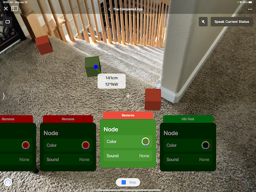

### My WWDC21 Swift Student Challenge submission
I made a playground book that teaches you the basics of ARKit through interactive lessons. It covers positioning, hit-testing, and how to calculate relationships between objects. In the end, it combines all these concepts into an app: A navigation aid for those who are visually impaired.

### Screenshots

Intro | Positioning | Distance | Angles | Completed App
--- | --- | --- | --- | ---
 |  |  |  | 
 |  |  |  | 

